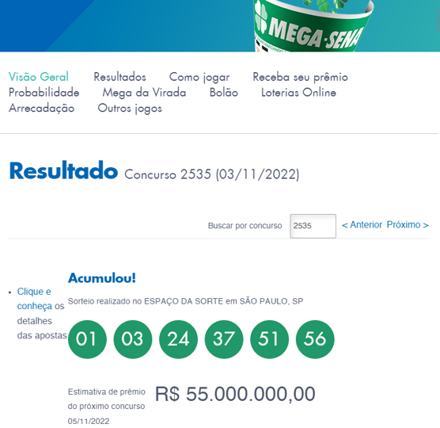
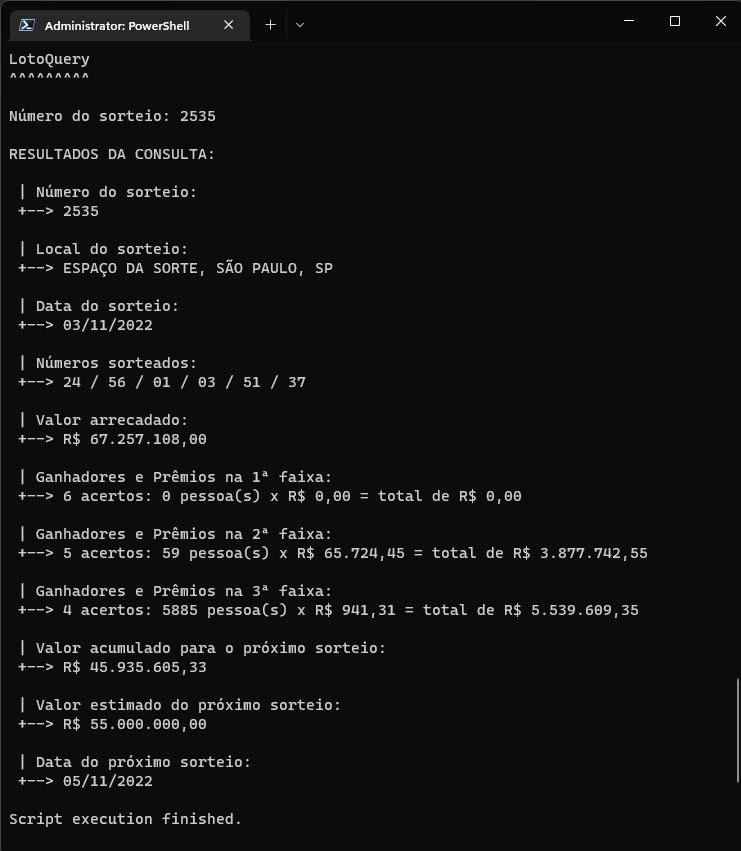
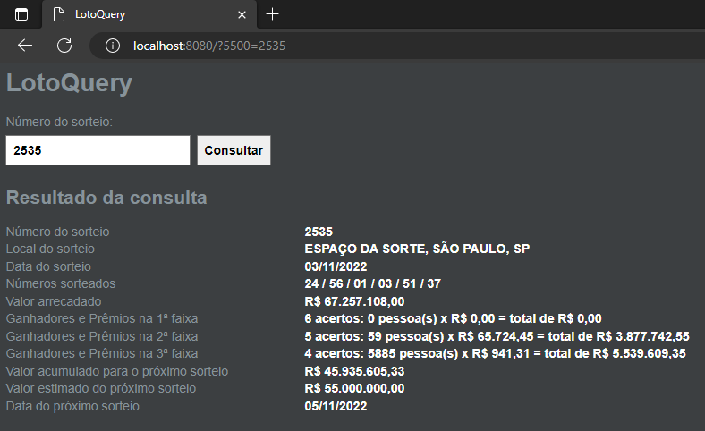
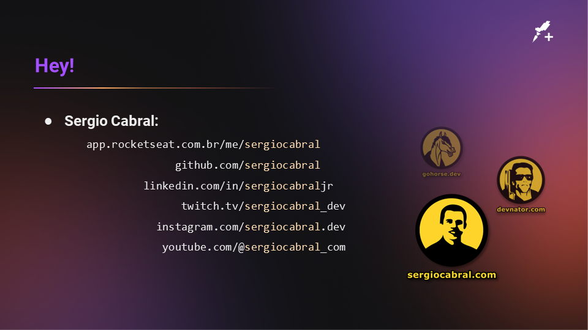
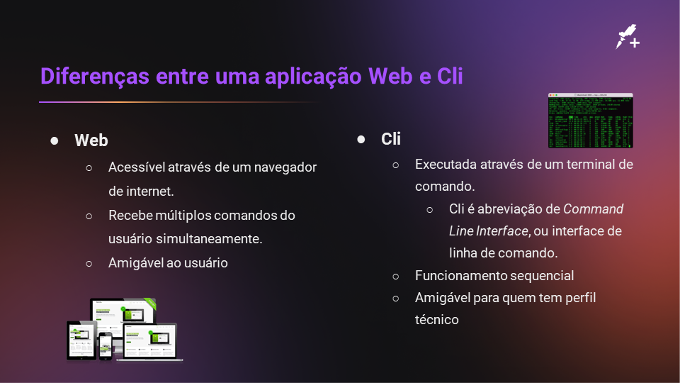

  

# PHP via Web e Cli

Este repositório exemplifica uma aplicação com mesma funcionalidade, mas que pode ser executado tanto via terminal (CLI) como via navegador (WEB).

A proposta é consultar o resultado da loteria da MegaSena no site da Caixa Econômica Federal.

E exibir de maneira personalizada conforme o objetivo da aplicação.
Veja abaixo os recortes de tela.

## Utilização via CLI

Passe o arquivo do código-fonte, `loto.php`, como argumento do interpretador do PHP: `php ./loto.php`.

Em um ambiente Unix (Linux ou macOS), usando hashbang na primeira linha do arquivo e definindo permissão de execução `+x`, se torna possível chamar diretamente pelo arquivo: `./loto.php`

## Utilização via WEB

Basta servir o arquivo do código-fonte, `loto.php`, através de um serviço Web, como Nginx, Apache ou outro.

Uma forma mais simples pode ser executar o próprio interpretador do PHP como servidor _standalone_ usando a chamada `php -S 0.0.0.0:80`, onde nesse caso a porta será a padrão 80.

O arquivo `index.php` foi criado como um facilitador para que o serviço Web carregue por padrão a aplicação, sem precisar informar o nome do arquivo com a aplicação de fato.

## Endereços Web

- Endereço da página oficial dos sorteios da Mega-Sena:
  - https://loterias.caixa.gov.br/Paginas/Mega-Sena.aspx
- Endereço da API:
  - https://servicebus2.caixa.gov.br/portaldeloterias/api/megasena/2537

## Slides da aula

## Rocketseat+

|  |
| :-: |
|[sergiocabral.com](https://sergiocabral.com)|